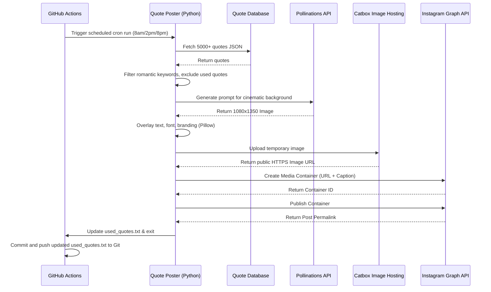

# 🤍 Automated Romantic Quote Poster

A fully autonomous, AI-powered Python bot that curates deeply romantic quotes, generates breathtaking unique backgrounds, and publishes them seamlessly to Instagram. It runs completely headless in the cloud using GitHub Actions, automatically maintaining an elegant Instagram feed 3 times a day.

## ✨ Features

- **Endless Unique Quotes:** Scrapes a massive open-source database and intelligently filters for romantic/love themes. It keeps track of `used_quotes.txt` to ensure a quote is never posted twice.
- **AI Cinematic Photography:** Uses the Pollinations API (`flux` model) to generate highly attractive, 100% unique cinematic backgrounds based on randomized romantic themes (e.g., "candlelit dinner", "red roses in the snow").
- **Dynamic Typography:** Uses Pillow (PIL) to beautifully format the quote and author over the image with custom cursive fonts, dynamic text wrapping, and elegant spacing.
- **Serverless Hosting:** Uploads the generated images directly to Catbox to generate a public HTTPS URL.
- **Meta Graph API Publishing:** Automatically creates an Instagram Media Container and publishes the post with a pre-formatted caption, hashtags, and creator mention.
- **Cloud Automation:** Fully integrated with GitHub Actions to run automatically on a schedule (3x per day) with zero manual intervention.

---

## 🔄 System Architecture Workflow

The system is designed to run asynchronously in the cloud. Below is the step-by-step lifecycle of a single execution:



---

## 🚀 Setup & Installation

### 1. Requirements
- A Meta Developer App with `instagram_basic` and `instagram_content_publish` permissions.
- An Instagram Professional/Business account connected to a Facebook Page.
- Python 3.11+

### 2. Local Setup
Clone the repository and install dependencies:
```bash
git clone https://github.com/vallarasuk/Love-Quotes.git
cd Love-Quotes
pip install -r requirements.txt
```

### 3. Environment Variables
Create a `.env` file in the root directory. You can use the included `get_credentials.py` script to easily generate your Meta tokens.

```env
POLLINATIONS_API_KEY="sk_your_api_key_here"
IG_USER_ID="your_instagram_user_id"
IG_ACCESS_TOKEN="your_permanent_page_access_token"
```

*(Note: Never commit your `.env` file to source control. It is explicitly ignored in `.gitignore`).*

### 4. Running Locally
To test the pipeline manually on your local machine:
```bash
python quote_poster.py
```

---

## ☁️ Deploying to GitHub Actions

This project is built to run entirely on GitHub.

1. Go to your GitHub Repository -> **Settings** -> **Secrets and variables** -> **Actions**.
2. Add the following **Repository Secrets**:
   - `POLLINATIONS_API_KEY`
   - `IG_USER_ID`
   - `IG_ACCESS_TOKEN`
3. Go to **Settings** -> **Actions** -> **General** -> **Workflow permissions**.
4. Check **Read and write permissions** (This is strictly required so the bot can update and push the `used_quotes.txt` file back to the repository after it posts).

Once configured, the bot will automatically wake up and post to your Instagram feed at **8:00 AM, 2:00 PM, and 8:00 PM (UTC)** every single day!
