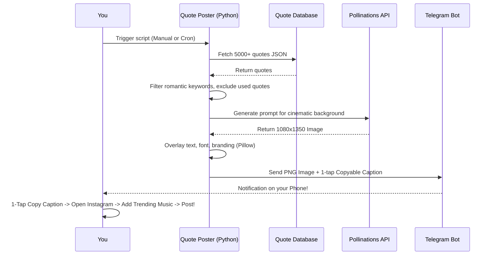

# 🤍 Automated Romantic Quote Poster

A fully autonomous, AI-powered Python bot that curates deeply romantic quotes, generates breathtaking unique backgrounds, and delivers them instantly to your phone via a **Telegram Bot**. This workflow allows you to maintain an elegant Instagram feed effortlessly while manually adding trending Instagram audio from your phone!

## ✨ Features

- **Endless Unique Quotes:** Scrapes a massive open-source database and intelligently filters for romantic/love themes. It keeps track of `used_quotes.txt` to ensure a quote is never posted twice.
- **AI Cinematic Photography:** Uses the Pollinations API (`flux` model) to generate highly attractive, 100% unique cinematic backgrounds based on randomized romantic themes (e.g., "candlelit dinner", "red roses in the snow").
- **Dynamic Typography:** Uses Pillow (PIL) to beautifully format the quote and author over the image with custom cursive fonts, dynamic text wrapping, and elegant spacing.
- **Telegram Bot Integration:** Sends the high-quality rendered image directly to your phone. It also sends a pre-formatted caption with hashtags that is completely 1-tap copyable!
- **Algorithm Optimized:** Because you post manually from your phone, you get 100% of the algorithmic reach by attaching currently trending Reels audio, which is impossible via the official Meta API.

---

## 🔄 System Architecture Workflow

The system is designed to run locally or in the cloud. Below is the step-by-step lifecycle of a single execution:



---

## 🚀 Setup & Installation

### 1. Requirements
- A Free Telegram Bot Token (from BotFather on Telegram).
- Your private Telegram Chat ID.
- Python 3.11+

### 2. Local Setup
Clone the repository and install dependencies:
```bash
git clone https://github.com/vallarasuk/Love-Quotes.git
cd Love-Quotes
./setup.sh
```

### 3. Environment Variables
Copy `.env.example` to `.env` and fill in your details:

```env
POLLINATIONS_API_KEY="your_pollinations_api_key_here"
IG_USER_ID="your_instagram_user_id_here"
IG_ACCESS_TOKEN="your_instagram_access_token_here"
TELEGRAM_BOT_TOKEN="your_telegram_bot_token_here"
TELEGRAM_CHAT_ID="your_telegram_chat_id_here"
```

*(Note: Never commit your `.env` file to source control. It is explicitly ignored in `.gitignore`).*

### 4. Running Locally
To run the pipeline manually on your local machine:
```bash
source .venv/bin/activate
python3 quote_poster.py
```

---

## ☁️ Deploying to GitHub Actions (Optional)

You can run this entirely in the cloud using GitHub Actions.

1. Go to your GitHub Repository -> **Settings** -> **Secrets and variables** -> **Actions**.
2. Add the following **Repository Secrets**:
   - `POLLINATIONS_API_KEY`
   - `TELEGRAM_BOT_TOKEN`
   - `TELEGRAM_CHAT_ID`
3. Go to **Settings** -> **Actions** -> **General** -> **Workflow permissions**.
4. Check **Read and write permissions** (This is strictly required so the bot can update and push the `used_quotes.txt` file back to the repository after it generates a quote).

Once configured, the bot will automatically send the posters to your phone every day!
